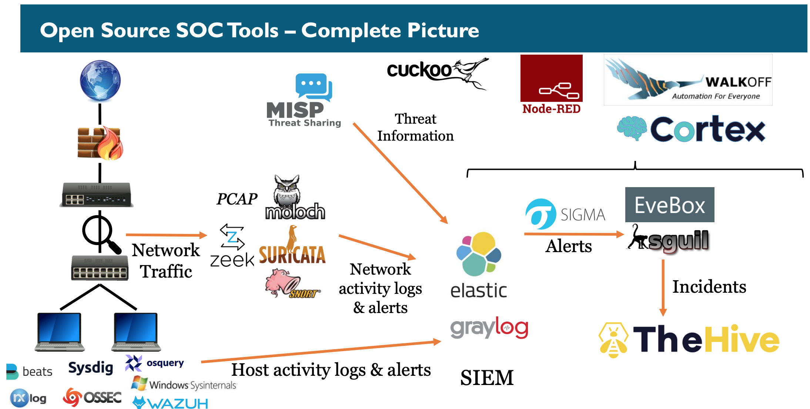

# Project Omnissiah

## Overview
Project Omnissiah is a collection of free and open source solutions intended to integrate typical processes and tools used in modern security operations centers (SOC). The objective of the project is to document a holistic security solution that integrates the components of the following open source projects to create an all-in-one SOC environment:

- **[Hunting Elk](https://github.com/Cyb3rWard0g/HELK)** - a threat hunting platform with advanced analytics capabilities such as SQL declarative language, network graphing, structured streaming, machine learning, and documentation engine driven by Jupyter notebooks and Apache Spark over an Elasticsearch stack.
- **[The Hive](https://thehive-project.org/)** - a scalable security incident response platform, tightly integrated with MISP (Malware Information Sharing Platform), designed to make analysis and incident response easier for SOCs and any information security practitioner dealing with security incidents that need to be investigated and acted upon swiftly.
- **[Security Onion](https://securityonion.net/)** - a network security intrusion detection systems (IDS) and intrusion prevention systems (IPS) that enables threat hunters, security analysts and SIEM engineers the ability to monitor their environments, identify threats, improve alert mechanisms and gain more visibility into enterprise environments by gathering endpoint, network, and infrastructure logs. In addition to Elasticsearch, Logstash, and the Kibana components, the solution includes IDS/IPS tools like Snort, Suricata, Zeek (formerly Bro), Wazuh, Sguil, Squert, CyberChef, NetworkMiner, and many other security tools.
- **[Moloch](https://molo.ch/)** - an indexed packet capture and search tool that enables users to search network artifacts directly within Moloch's packet capture indexes to identify communication patterns occurring in enterprise networks.

### Networking Requirements
  - Network routing with NAT translation in order to make connections from within the LAN outbound to the Internet.
  - Network switching that will allow for virtual local area networks (VLANs) to segment the various infrastructure and services on the network
  - Network port mirroring to allow packets to be copied over to a destination switch interface port where network traffic will be funneled through various network monitoring sensors.
  - Support for multiple wireless access point SSIDs

### Virtualization Requirements
  - Hardware virtualization capable of supporting virtual networking appliances, specifically switches
  - Hardware virtualization capable of supporting pooled computing and storage resources
  - Hardware virtualization capable of supporting containerized workloads

### Storage Requirements
  - 24 hour rolling retention of full PCAP data
  - Three month rolling retention of source code commit history logs, CI/CD logs, and deployment logs
  - Six month rolling retention of endpoint access and authentication logs
  - Six month rolling retention of network access and authentication logs

### Security Requirements
  - Least privileged access to all physical hosts, virtual hosts, and networking appliances
  - Authenticated access to all physical and virtual hosts
  - Jump host routing/proxy access to physical and virtual hosts
  - Whitelisted IP addressed of management devices
  - Full PCAP storage on security lab physical and virtual networks

### Compliance Requirements
  - Logging for all physical endpoints, virtual endpoints, and containerized workloads
  - Log forwarding support for hardware firewall appliance, hypervisor hosts, wireless access points, virtual servers, and networked workstations
  - Key and secrets management integration into configuration management tool - ansible
